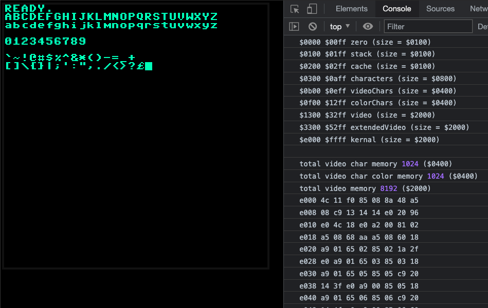

# MACLE - Machine Assembly Code Learning Environment
_A toy 8-bit machine emulated in JavaScript. Implements most of the 6502 instruction set plus some extras for convenience and debugging. (I created this as a way to learn 6502 as I was learning to program my Commodore 64.) Has a small kernal written in assembly to output characters to the screen, blink the cursor (using interrupts), and echo keyboard input to the screen._

See the `prg/` folder for test programs and the kernal code (`kernal.s`). To run any of these change the `fileName` in the `loadKernal()` method in `parser.js`.

A primitive parser (`parser.js`) converts the assembly to machine code which is executed in `cpu.js`.

The instruction set is defined in `instruction-set.js`.

A memory map can be found in the console when running and also in `memory-map.js`.

The character set is defined in `chars.js`.

Uses [PixiJS](https://pixijs.com/) for rendering all the pixels.



----
## Demo

[https://rscottfree.github.io/machine-assembly-code-learning-environment/](https://rscottfree.github.io/machine-assembly-code-learning-environment/)

----
## Running it

Clone
```
npm install
npm start
```
Go to [http://localhost:8080](http://localhost:8080)

----
## Acknowledgments
- The Commodore 64 & [_The Programmer's Reference Guide_](https://archive.org/details/c64-programmer-ref/)
- Jim Butterfield's book [_Machine Language for the Commodore 64_](https://archive.org/details/Machine_Language_for_the_Commodore_64_and_Other_Commodore_Computers_1984_Brady_Communications/)
- Robin at [8-Bit Show and Tell](https://www.8bitshowandtell.com)


----
## References

**Instructions**

- [https://www.masswerk.at/6502/6502_instruction_set.html](https://www.masswerk.at/6502/6502_instruction_set.html)
- [https://dwheeler.com/6502/oneelkruns/asm1step.html](https://dwheeler.com/6502/oneelkruns/asm1step.html)

**Stack and interrupts**

- [https://wiki.nesdev.com/w/index.php/Stack](https://wiki.nesdev.com/w/index.php/Stack)
- [https://www.c64-wiki.com/wiki/Interrupt](https://www.c64-wiki.com/wiki/Interrupt)
- [https://dustlayer.com/c64-coding-tutorials/2013/4/8/episode-2-3-did-i-interrupt-you](https://dustlayer.com/c64-coding-tutorials/2013/4/8/episode-2-3-did-i-interrupt-you)

**Interrupts**

- [https://www.pagetable.com/?p=410](https://www.pagetable.com/?p=410)
- [http://www.6502.org/tutorials/register_preservation.html](http://www.6502.org/tutorials/register_preservation.html)
- [http://www.6502.org/tutorials/interrupts.html#1.3](http://www.6502.org/tutorials/interrupts.html#1.3)
